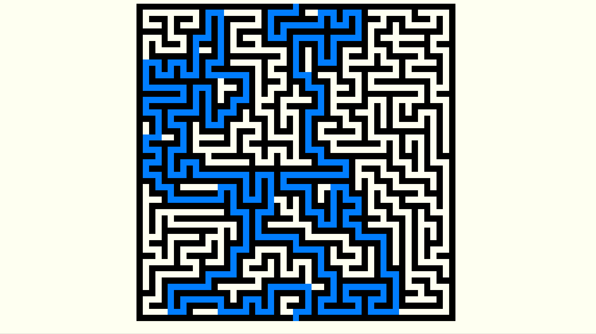

# Maze-Game
A maze generator and game created with the Unity Engine.

# Introduction
I created this project between May and June 2019. After taking a course in AI in the previous Spring semester, I wanted to implement a maze generating and solving program. I successfully implemented maze generation via DFS, but never got around to solving as it would'nt fit into the program in it's current state. Perhaps in the future I will revisit and add the additional functionality.

# Installation
Clone the repository locally, and open the project folder in Unity. Open the file "SampleScene.unity" in the directory "Assets/Scenes" and the project should be good to go.
